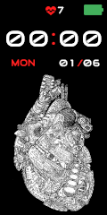
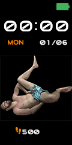
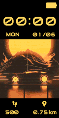

# My Watch Faces

## Amazfit GTS

To edit and pack/unpack Amazfit GTS skins, use the following windows app: https://github.com/chm-dev/GTS-watchface-bundle

## Mi Band 4

To edit and pack/unpack Mi Band 4 skins, use the following windows app: https://amazfitwatchfaces.com/forum/viewtopic.php?f=29&t=890

